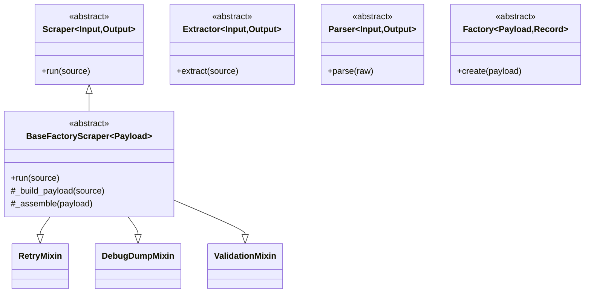

# ADR 0005: Canonical domain role taxonomy and import path

- Status: Accepted
- Date: 2026-04-10

## Context

W kodzie współistniały historyczne nazwy ról (`Assembler`, `PipelineService`) oraz niekanoniczna ścieżka importu (`scrapers.base_domain_roles`).
To utrudnia utrzymanie SRP i czytelność warstw (co jest scraperem, co parserem, co fabryką modelu domenowego).

## Decision

Wprowadzamy słownik ról i jedną kanoniczną ścieżkę importu:

- `Scraper` = pobieranie + orkiestracja przepływu,
- `Extractor` = składanie danych z wielu źródeł,
- `Parser` = transformacja HTML/tekst -> struktura,
- `Factory` = tworzenie modelu domenowego.

Kanoniczny moduł: `scrapers.core.domain_roles`.

Dodatkowo:
- bazowy serwis orkiestracji domenowej otrzymuje nazwę `BaseFactoryScraper`,
- `layers/domain_roles.py` eksportuje wyłącznie nazwy kanoniczne,
- uruchamiany jest check CI blokujący nowe importy ze ścieżek historycznych.

## Class hierarchy (canonical)

## Inheritance / mixin rules

1. Dziedziczenie po klasach ról (`Scraper`, `Extractor`, `Parser`, `Factory`) tylko gdy klasa implementuje ich kontrakt 1:1.
2. Mixiny (`RetryMixin`, `DebugDumpMixin`, `ValidationMixin`) dopuszczalne wyłącznie jako zachowanie przekrojowe, bez wiedzy domenowej.
3. Mixin nie może importować parserów/fabryk domenowych (brak odwrócenia kierunku zależności).
4. Nowe importy ról muszą używać `scrapers.core.domain_roles`.

## Consequences

- Spójne nazewnictwo i granice odpowiedzialności.
- Szybsze review architektoniczne (brak aliasów legacy).
- Twardy gate CI dla importów niekanonicznych.
